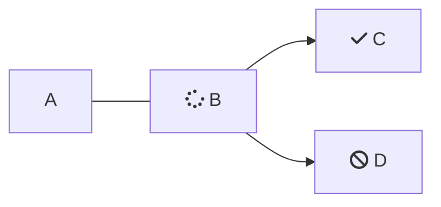

| Things that are cool | Other things |
| :------------------- | :----------- |
| Cheese               | Jalapenos    |
| Tacos, all kinds     | Baseballs    |
| super cool shades    | raybans?     |
| Pizzas               | Willem Dafoe |
| Barnacles            | pelicans     |
| Flowers              | cats         |
| crabs                | cheetos yum  |

I'm updating this via Git! Wowwww

 

These are JSX powered tables:

<Table align={["left","left","left"]}>
  <thead>
    <tr>
      <th style={{ textAlign: "left" }}>
        One
      </th>

      <th style={{ textAlign: "left" }}>
        Two
      </th>

      <th style={{ textAlign: "left" }}>
        Three
      </th>
    </tr>
  </thead>

  <tbody>
    <tr>
      <td style={{ textAlign: "left" }}>
        Cheese

        * 1
        * 2
        * 3
      </td>

      <td style={{ textAlign: "left" }}>
        Nachos

        <Glossary>parliament</Glossary>
      </td>

      <td style={{ textAlign: "left" }}>
        Pizzas
      </td>
    </tr>

    <tr>
      <td style={{ textAlign: "left" }}>
        Friends
      </td>

      <td style={{ textAlign: "left" }}>
        Fun
      </td>

      <td style={{ textAlign: "left" }}>
        Magic
      </td>
    </tr>
  </tbody>
</Table>